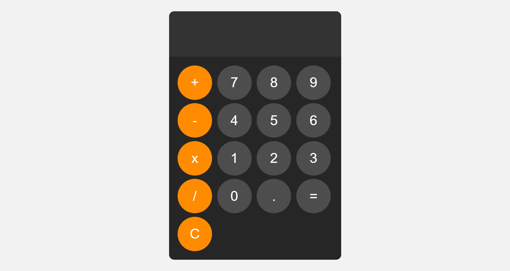

# Calculator

A simple and responsive calculator built using **HTML, CSS, and JavaScript**. This project provides basic arithmetic operations with a modern and minimalistic UI.

## Features

- Perform basic arithmetic operations: **Addition, Subtraction, Multiplication, and Division**
- Clear button to reset calculations
- Interactive button hover and click effects
- User-friendly layout with rounded buttons

## Technologies Used

- **HTML** - Structure of the calculator
- **CSS** - Styling and layout
- **JavaScript** - Logic for performing calculations

## Usage

1. Clone this repository:
   ```sh
   git clone https://github.com/Deyasin-Srijon/Calculator.git
   ```
2. Open `index.html` in your browser.
3. Click the buttons to input numbers and operators.
4. Press `=` to evaluate the expression.
5. Use `C` to clear the display.

## File Structure

```
Calculator/
│── index.html   (Main structure of the calculator)
│── style.css    (Styling and design)
│── app.js       (Functionality and logic)
└── README.md    (Project documentation)
```

## Screenshots



## Future Enhancements

- Implement a dark/light mode toggle
- Add keyboard support for calculations
- Improve error handling for invalid inputs

## Contributing

Contributions are welcome! Feel free to fork the repository and submit a pull request with improvements.
